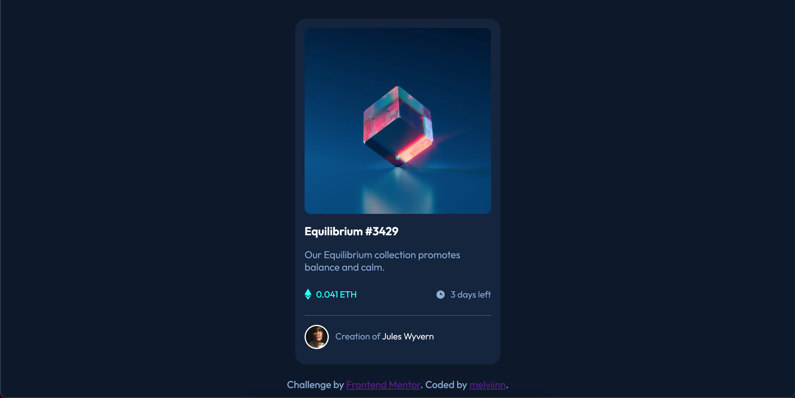

# Frontend Mentor - NFT preview card component solution

This is a solution to the [NFT preview card component challenge on Frontend Mentor](https://www.frontendmentor.io/challenges/nft-preview-card-component-SbdUL_w0U). Frontend Mentor challenges help you improve your coding skills by building realistic projects.

## Table of contents

  - [Links](#links)
  - [My process](#my-process)
    - [Built with](#built-with)
  - [Author](#author)

## Links

- Solution URL: [melviinn/nft-preview-card](https://www.frontendmentor.io/solutions/nft-preview-card-component-htmlcss-eq76YpLPee)
- Live Site URL: [nft-preview-card.vercel.app](https://nft-preview-card-dun.vercel.app/)

## My process

  ### Built with

- Semantic HTML5 markup
- CSS custom properties
- Flexbox

## Author

- Github - [melviinn](https://github.com/melviinn)
- Frontend Mentor - [@melviinn](https://www.frontendmentor.io/profile/melviinn)
- Instagram - [@_melviin.dch](https://www.instagram.com/_melviin.dch/?hl=fr)